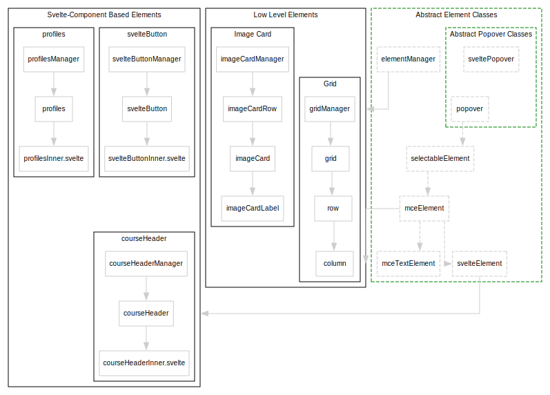

<p align="center">
  
</p>
<h1 align="center">Canvas Design Blocks</h1>
<p align="center">
  
  <a href="#">
    
  </a>
  
</p>
<p align="center">Create and edit no-code design elements built right into your Canvas Pages!</p>

## Table of Contents

- [About](#about)
- [Features](#features)
- [Installation](#installation)
  - [Theme Installation](#theme-installation)
  - [User Script Installation](#user-script-installation)
- [Development](#development)
  - [Getting Started](#getting-started)
  - [Creating new elements](#creating-new-elements)

## Features

### Grids

- Create simple responsive grid layouts in-editor
- Adjust background colours and create drop-shadow cards to highlight important content
  

### Buttons

- Make links stand out with customisable buttons
- Swap button colours and add icons to make your buttons pop
  

### Headers

- Create headers for your course pages, with built-in background image and layout options
  

### Image Card Navigation

- Create image cards with customisable links to other pages in your course
- Best used for top-level navigation
  

### Deep integration into Canvas RCE

- All design blocks are fully integrated into the Canvas RCE, so you can edit them just like any other content
- The editing interface uses popups with settings overlaid on the page, so you can see how your changes will look in real-time, and easily make adjustments
  

## Installation

Canvas Design Blocks works as a theme for Canvas, but can be installed as a user script using a browser extension like [Tampermonkey](https://www.tampermonkey.net/) for testing.

**NOTE: Other users will have to install the script to see the designs, so you will need to use the theme version for production.**

### Building the Theme

Installing this theme requires you to build your own version of the theme, as it requires a number of configuration options to be set.

To do this, follow the steps below:

#### Prerequisites

You will need the following:

- A Canvas instance to test the theme on
- A static web server to host the theme files. We use [S3](https://aws.amazon.com/s3/) behind [Cloudfront](https://aws.amazon.com/cloudfront/) in production, and [Caprover](https://caprover.com/) to host CI/CD instances for testing.

You will also need to have the following installed:

- [Git](https://git-scm.com/) (for cloning the repository)
- [Node.js](https://nodejs.org/en/) and [Yarn](https://yarnpkg.com/getting-started/install) (for building the theme)
- [Python](https://www.python.org/) installed on your machine (for the custom icons)
- [PicoSVG](https://github.com/googlefonts/picosvg) - you can install this using `pip install picosvg`

#### Configuration and Building

1. Clone the repository into a local folder:

```Shell
git clone https://github.com/Ranga-Auaha-Ako/canvas-design-blocks
```

2. Create the JSON for your version of the theme. The JSON should follow this structure (note: remove the commnets before using):

```JSON
{
// Primary colour for the theme
"primary": "#AB0520",
// Secondary colour for the theme
"secondary": "#AB0520",
// Define colours for each faculty (optional)
"faculty": {
  "arts": "#AB0520",
},
// Define accessible light & dark colours for use in the theme
"palette": {
  "dark": {
			"barney": "#BF32A4",
			"info": "#0374B5",
			"success": "#0B874B",
			"danger": "#E0061F",
			"warning": "#FC5E13"
  },
  "light": {
			"white": "#FFFFFF"
		}
}
}
```

3. Create a `.env` file in the root of the project with the following contents, replacing the values with your own:

```Shell
CANVAS_BLOCKS_BASE_DOMAINS=YOUR_CANVAS_DOMAIN
CANVAS_BLOCKS_THEME_CONTACT_NAME=YOUR_CONTACT_NAME
CANVAS_BLOCKS_THEME_CONTACT_LINK=YOUR_CONTACT_LINK
CANVAS_BLOCKS_THEME=`PASTE_JSON_HERE`
CANVAS_BLOCKS_THEME_HOST=YOUR_FILE_HOST
```

Note: `CANVAS_BLOCKS_THEME` should be the JSON you created in step 2.

`YOUR_CANVAS_DOMAIN` should be the domain of your Canvas instance, e.g. `canvas.instructure.com`.

`YOUR_FILE_HOST` should be the domain where you will host the theme files, e.g. `https://xxx.cloudfront.net/`. It should be a domain that supports HTTPS and can be accessed by users on your Canvas instance. These files will potentially download on every page load, so set responsible caching headers and use a CDN if required.

4. (Optional) Create a `custom` folder in `/src/lib/icons/assets/` and create a folder for each category of custom icons you want to include. You can use any SVG icons you like. To allow Design Blocks to use the icons, you will need to creat a `meta.json` file in the category folder. You can view an example at `/src/lib/icon/assets/instructure/meta.json`. Once created, you can edit the file using our [Beta custom icons editor](https://icon-editor.c.raa.amazon.auckland.ac.nz/).

5. Run `yarn install` to install dependencies

6. Run `yarn build` to build the theme. This will take a while, as it needs to convert the SVG icons into a format that can be used in the theme.

7. The theme will be built into the `dist` folder. You can now follow the instructions below to install the theme.

### Theme Installation

> [!CAUTION]
> This theme will be visible to all users on your Canvas instance, so ensure you have tested it thoroughly before applying it. You may want to use the user script installation method for testing.

1. Host the `dist` folder on a static web server (e.g. S3 behind Cloudfront) which supports HTTPS and can be accessed by users on your Canvas instance. These files will potentially download on every page load, so set responsible caching headers and use a CDN if required.
2. In Canvas, go to **Admin > Themes > Add Theme** and add the following content to the **CSS** section, replacing `{INSERT_HOST_HERE}` with the URL of the folder you hosted in step 2:

```css
@import url("{INSERT_HOST_HERE}/canvas-blocks.css}");
/* Design Blocks End */
```

3. Add the following content to the **JavaScript** section, replacing `{INSERT_HOST_HERE}` with the URL of the folder you hosted in step 2, and `{VERSION}` with the version of the release you downloaded (adding the version number to the URL is reccomended but not required):

```js
// Design Blocks Start
(function (n) {
  typeof define == "function" && define.amd ? define(n) : n();
})(function () {
  "use strict";
  const n = document.createElement("script");
  (n.src = "{INSERT_HOST_HERE}/canvas-blocks.min.js?v={VERSION}"),
    (n.type = "module"),
    (document.head || document.documentElement).appendChild(n);
});

// Design Blocks End
```

4. Save and apply the theme. You're done!

### User Script Installation

> [!NOTE]  
> This method is only for testing the theme. Other users will have to install the script to see the designs, so you will need to use the theme version for production.

1. Host the `dist` folder on a static web server (e.g. S3 behind Cloudfront) which supports HTTPS and can be accessed by users on your Canvas instance. These files will potentially download on every page load, so set responsible caching headers and use a CDN if required.
2. Install the [Tampermonkey](https://www.tampermonkey.net/) browser extension.
3. Create a new script in Tampermonkey, with the following content:

```js
// ==UserScript==
// @name         Canvas Design Blocks (Test)
// @namespace    https://raa.auckland.ac.nz
// @version      0.1
// @description  Adds Canvas Design Blocks from the development instance to Canvas;;
// @author       Ranga Auaha Ako, University of Auckland
// @match        https://*.instructure.com/*
// @icon         https://www.google.com/s2/favicons?sz=64&domain=instructure.com
// @grant        GM_addElement
// ==/UserScript==

(function () {
  const builtVersion = true;
  if (builtVersion) {
    GM_addElement("script", {
      src: "https://_YOUR_THEME_HOST_/canvas-blocks.min.js",
      type: "module",
    });
    GM_addElement("link", {
      href: "https://_YOUR_THEME_HOST_/canvas-blocks.css",
      rel: "stylesheet",
    });
  } else {
    GM_addElement("script", {
      src: "http://localhost:5173/src/main.ts",
      type: "module",
    });
  }
})();
```

3. Replace `_YOUR_THEME_HOST_` with the URL of the folder you hosted in step 1.

4. Update the `@match` line to match the domain of your Canvas instance, if it does not already.

5. Save the script and navigate to your Canvas instance. You're done!

## Development

This project is built on [Vite](https://vitejs.dev/) and [Svelte](https://svelte.dev/). To get started, you will need to have [Node.js](https://nodejs.org/en/) installed, as well as [Yarn V3](https://v3.yarnpkg.com/).

For the custom icons, this project also makes use of Google's [PicoSVG](https://github.com/googlefonts/picosvg) library, which requires Python. Install it using `pip install picosvg` and ensure it is available on your path.

Changelogs are kept to the [Keep a Changelog v1.1.0](https://keepachangelog.com/en/1.1.0/) standard.

### Getting Started

1. Clone the repository
2. Create a `.env` file in the root of the project with the following contents, replacing the values with your own:

```Shell
# Your domain, e.g. https://canvas.instructure.com
# NOTE: This will be used to pull styles from the Canvas theme, so it must be a valid Canvas domain.
CANVAS_BLOCKS_BASE_DOMAINS={YOUR_CANVAS_DOMAIN}
# For production, what domain are you hosting this theme on?
CANVAS_BLOCKS_THEME_HOST=http://localhost:5173/
# What contact details do you want to display in the sidebar for support?
CANVAS_BLOCKS_THEME_CONTACT_NAME={YOUR_CONTACT_NAME}
CANVAS_BLOCKS_THEME_CONTACT_EMAIL={YOUR_CONTACT_EMAIL}
```

3. Run `yarn install` to install dependencies
4. Run `yarn dev` to start the development server.
5. Open `http://localhost:5173/` in your browser to view the demo page.

This will start a local server which will serve the demo page and the theme files. The demo page will automatically reload when changes are made to the source files.

### Creating new elements

Design Blocks provides a number of abstract classes you can implement to handle most of the heavy lifting interacting with the Canvas and TinyMCE APIs. You should start by reading through the [existing elements](src/lib/elements) to get an idea of how they work.

New elements have the following high-level components:

1. An **Element Manager**, which is responsible for overseeing all instances of the element on the page, and handling the discovery and creation of new instances of the element.

   - All element managers should extend the [`ElementManager`](src/lib/elements/generic/elementManager.ts) class, and be loaded in `main.ts`

2. An **Element**, which represents a specific instance of the element on the page. This is responsible for rendering the element in the TinyMCE editor, and handling any changes made to the element. There are two ways to do this.

   - Extend the [`MceElement`](src/lib/elements/generic/mceElement.ts) class, which provides a number of helper functions for interacting with the TinyMCE API. This is the more _low-level_ approach, and is used for elements which require more direct control over the TinyMCE editor.
   - Extend the [`SvelteElement`](src/lib/elements/generic/svelteElement.ts) class, which provides a number of helper functions for interacting with the TinyMCE API, and also renders a Svelte component in the editor. This is the more _high-level_ approach, and is used for elements which can be easily represented by a Svelte component in-editor. **This is the recommended approach** for most elements which won't contain other elements or complex content. You can see an example of this in the [Button](src/lib/elements/svelteButton) element.

3. A **Svelte Component**, which is used to render the element in the TinyMCE editor. This is only required if you are using the `SvelteElement` class.

4. A **Styles** file, which is used to style the element in the TinyMCE editor and on the page.

5. A **Popup Component**, which is used to render the element's settings popup. This is only required if you have additional settings which should be displayed in a popup.

For a visual overview of how the existing components fit together, see the component diagram here:

[](docs/assets/elements.svg)
