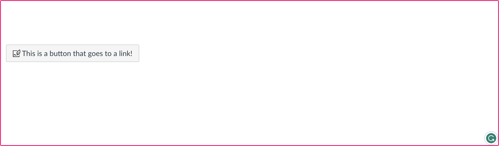

<p align="center">
  
</p>
<h1 align="center">Canvas Design Blocks</h1>
<p align="center">
  
  <a href="#">
    
  </a>
  
</p>


Canvas Design Blocks adds interactive no-code design elements to the Canvas LMS Rich Content Editor (RCE) during content edit mode in the following Canvas LMS areas: 
- Pages, &nbsp; Discussions, &nbsp; Assignments, &nbsp; Quizzes (classic quizzes only)


Deployed as a Canvas theme, it integrates directly into the existing Canvas editing interface through JavaScript and CSS injection, rendering dedicated rich content editors within popovers for component editing alongside standard Canvas content editing options. Its modularised design makes adding new components easy for developers.


- [Features](#features)
- [Testing the Theme](#testing-the-theme)
- [Installation and Usage](README_Installation_guide.md)
- [Code Flow and Feature Details](README_code_flow_and_feature_details.md)

<br>

## Features

> ✨ You can try the main features of Canvas Design Blocks on our **[Sandpit Page](https://ranga-auaha-ako.github.io/canvas-design-blocks/?block=courseHeader)** , which simulates the subset of features that runs without the Canvas LMS environment.
> 
> The full features of the Canvas Design Blocks require the Canvas LMS environment to function (for example, searching for links). To see the full functionality, you will need to build the custom theme from the code in this repository and install the theme in your Canvas instance.


### Deep integration into Canvas RCE

- All design blocks are fully integrated into the Canvas RCE, so you can edit them just like any other content
- The editing interface uses popups with settings overlaid on the page, so you can see how your changes will look in real-time, and easily make adjustments


Current components and functionalities: 


### Button Bar

- Create a bar of buttons to highlight important links, or indicate progress through a course

&nbsp; &nbsp;  &nbsp; &nbsp;  


### Button

- Make links stand out with customisable buttons
- Swap button colours and add icons to make your buttons pop

 &nbsp; &nbsp;  &nbsp; &nbsp;    


### Grid

- Create simple responsive grid layouts in-editor
- Adjust background colours and create drop-shadow cards to highlight important content

 &nbsp; &nbsp;  &nbsp; &nbsp;    


### Header

- Create headers for your course pages with built-in background image and layout options
- Automatically manages text and background colour contrast across different themes

 &nbsp; &nbsp;  &nbsp; &nbsp;  


### Custom Icons

- Use a library of Canvas and institutional icons to help with quick scanning of page content and to highlight important information

 &nbsp; &nbsp;  &nbsp; &nbsp;  


### Image Card Navigation

- Create image cards with customisable links to other pages in your course
- Best used for top-level navigation  

 &nbsp; &nbsp;  &nbsp; &nbsp;  


### Profiles

- Automatically load in Canvas user profiles into your pages  
- Customise the layout and display of the profile 

&nbsp; &nbsp;  &nbsp; &nbsp;  

### Glossary

- Simple interface for creating and editing course glossaries with automatic Canvas page and module setup, plus CSV import/export for bulk term management
- Automatically highlights glossary terms throughout course content with hover tooltips, click definitions, and collapsible page glossary summary

 &nbsp; &nbsp;  &nbsp; &nbsp;  

<br>


## Testing the theme

If you want to skip the details and just try Design Blocks out in a test Canvas environment, you can install the version of the theme hosted on GitHub Pages. To do this, follow the instructions below:

<details>
<summary>Please click to view details</summary>
<br>

>❗<font color='red'>[IMPORTANT]</font>
> Do NOT use this method for production, as the files are hosted on GitHub Pages and may not be available in the future. If they become unavailable, the theme will stop working and Canvas may take _up to a minute_ to load any pages. Additionally, the theme is not customisable using this method. From a security perspective, it is not recommended to use this method in a production environment as it will enable a third party (this GitHub Pages) to inject arbitrary code into your Canvas instance.

1. In Canvas, go to **Admin > Themes > Add Theme** (or edit an existing one). In the left-hand editor panel, choose the "Upload" tab at the top.
2. Download the current styles (or create a new `theme.css` file) and paste the contents of the [Canvas Design Blocks CSS ("canvas-blocks.css")](https://ranga-auaha-ako.github.io/canvas-design-blocks/canvas-blocks.css) file into the TOP your CSS file. **Note: You need to include the CSS at the top of any other CSS you have in your theme, as it uses an @import statement to pull in the Canvas theme styles.**
3. Download/create a `theme.js`file, and paste the contents of the [Canvas Design Blocks JS ("canvas-blocks.min.js")](https://ranga-auaha-ako.github.io/canvas-design-blocks/canvas-blocks.min.js) file into the BOTTOM of your JS file. If you don't have a custom JS file, you can simple download and use the Design Blocks JS file as-is.
4. Save and apply the theme. You're done!


### Alternative Method:


For quick testing: Canvas Design Blocks works as a theme for Canvas, but can be installed as a user script using a browser extension like [Tampermonkey](https://www.tampermonkey.net/) for testing. You can use the hosted demo `.css` and `.js` scripts linked above and follow the instructions below:

<details>
<summary>Please click to view details</summary>


> [⚠️ NOTE]  
> This method is only for testing the theme. Other users will have to install the script to see the designs, so you will need to use the theme version for production.


1. Host the `dist` folder on a static web server (e.g. S3 behind Cloudfront) which supports HTTPS and can be accessed by users on your Canvas instance. These files will potentially download on every page load, so set responsible caching headers and use a CDN if required.
2. Install the [Tampermonkey](https://www.tampermonkey.net/) browser extension.
3. Create a new script in Tampermonkey, with the following content:

```js
// ==UserScript==
// @name         Canvas Design Blocks (Test)
// @namespace    https://raa.auckland.ac.nz
// @version      0.1
// @description  Adds Canvas Design Blocks from the development instance to Canvas;;
// @author       Ranga Auaha Ako, University of Auckland
// @match        https://*.instructure.com/*
// @icon         https://www.google.com/s2/favicons?sz=64&domain=instructure.com
// @grant        GM_addElement
// ==/UserScript==

(function () {
  const builtVersion = true;
  if (builtVersion) {
    GM_addElement("script", {
      src: "https://_YOUR_THEME_HOST_/canvas-blocks.min.js",
      type: "module",
    });
    GM_addElement("link", {
      href: "https://_YOUR_THEME_HOST_/canvas-blocks.css",
      rel: "stylesheet",
    });
  } else {
    GM_addElement("script", {
      src: "http://localhost:5173/src/desktop.ts",
      type: "module",
    });
  }
})();
```

3. Replace `_YOUR_THEME_HOST_` with the URL of the folder you hosted in step 1.

4. Update the `@match` line to match the domain of your Canvas instance, if it does not already.

5. Save the script and navigate to your Canvas instance. You're done!
</details>
</details>

## Installation and Usage

For testing/ installing/ developing the full functionality, you will need to build the custom theme from the code in this repository and install the theme in your Canvas instance.

Please see [detailed instructions here](README_Installation_guide.md).


## Technical Documentations & Feature Details

[Please visit here](README_code_flow_and_feature_details.md) for detailed code execution flow and function description of each component.