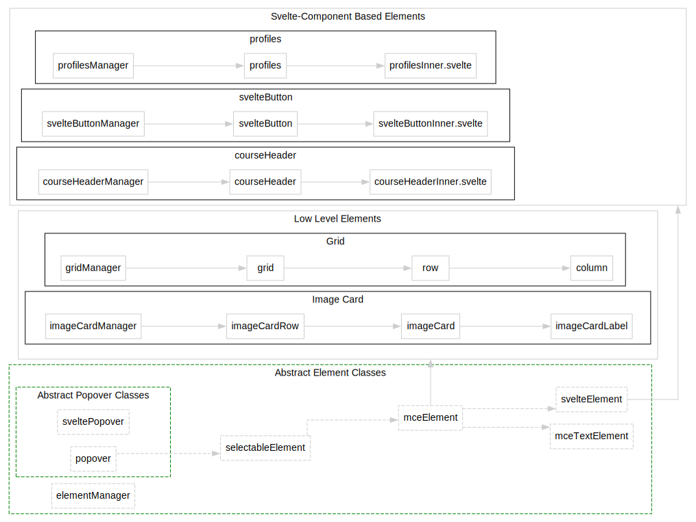

# Installation and Usage

## Requirements


For proper theme building and testing, you will need to have the following installed:

> - [Node.js](https://nodejs.org/en/) and [Yarn >= 3](https://yarnpkg.com/getting-started/install) (for building the theme. You might get a prompt to install [Vite](https://vite.dev/guide/) as well)
> - [Python >= 3.8](https://www.python.org/) installed on your machine or the project environment (for building the custom icons)
> - [PicoSVG](https://github.com/googlefonts/picosvg) - you can install this using `pip3 install picosvg` ([picosvg requires Python >=3.8](https://pypi.org/project/picosvg/))


For Deploying to a Canvas LMS Environment, you will also need the following:

> - A Canvas instance to test the theme on
> - A static web server to host the theme files &nbsp;  (We use [S3](https://aws.amazon.com/s3/) behind [Cloudfront](https://aws.amazon.com/cloudfront/) in production, and [Caprover](https://caprover.com/) to host CI/CD instances for testing)


## Installation

<details>
<summary>Please click to view details:</summary>

1. Clone the repository into a local folder (or manually download it as a .zip file):

    ```Shell
    git clone https://github.com/Ranga-Auaha-Ako/canvas-design-blocks
    ```


2. Create a `.env` file (or modify the `.env.example` file and rename into `.env`) in the root of the project with the following contents, replacing the values with your own:

    ```
    CANVAS_BLOCKS_BASE_DOMAINS = YOUR_CANVAS_DOMAIN
    
    CANVAS_BLOCKS_THEME_HOST = YOUR_FILE_HOST
    
    CANVAS_BLOCKS_THEME_CONTACT_NAME = YOUR_CONTACT_NAME
    CANVAS_BLOCKS_THEME_CONTACT_LINK = YOUR_CONTACT_LINK
    
    CANVAS_BLOCKS_DISABLE_FONTCACHE=true
    
    CANVAS_BLOCKS_THEME = `____PASTE_JSON_HERE____`
    ```

* ⚠️ Note:

  * `YOUR_CANVAS_DOMAIN`: &nbsp; should be the domain of your Canvas instance, e.g. `canvas.instructure.com`.

  * `YOUR_FILE_HOST`: &nbsp; should be the domain where you will host the theme files, e.g. `https://xxx.cloudfront.net/`. It should be a domain that supports HTTPS and can be accessed by users on your Canvas instance. These files will potentially download on every page load, so set responsible caching headers and use a CDN if required.
  
  * `CANVAS_BLOCKS_THEME_CONTACT_NAME`: &nbsp; optional and can be added to the `Feedback` section at the bottom of the Design Block Toolbar ([see script here](https://github.com/Ranga-Auaha-Ako/canvas-design-blocks/blob/main/src/entrypoints/Toolbar.svelte)). E.g.:`IT Service`.

  * `CANVAS_BLOCKS_THEME_CONTACT_LINK`: &nbsp; should be the url that is embedded in the `Feedback` section at the bottom of the Design Block Toolbar ([see script here](https://github.com/Ranga-Auaha-Ako/canvas-design-blocks/blob/main/src/entrypoints/Toolbar.svelte)). E.g.: `https://example.com`, or `mailto:name@example.com`.

  * `CANVAS_BLOCKS_DISABLE_FONTCACHE`: &nbsp; used in `src/lib/icons/vite/icons.ts` for building icons. Set to `true` for a clean production build.
  
  * `CANVAS_BLOCKS_MAX_WIDTH`: &nbsp; Design Blocks component max width in px. If not set, maxWidth=100%. Used in `tailwind.config.cjs` and `src/lib/util/constants.ts`. 

  * `CANVAS_BLOCKS_THEME`: &nbsp; should be the JSON content you created in the next step.


3. In the `.env` file, add the JSON for your version of the theme and palette for the component colour pickers. The JSON should follow this structure (️⚠️ Note: remove the comments before using):

    ```JSON
    CANVAS_BLOCKS_THEME=`{
        // Primary colour for the theme
        "primary": "#AB0520",
        // Secondary colour for the theme
        "secondary": "#AB0520",
        // Define colours for each faculty (optional)
        "palette": {
          "barney": "#BF32A4",
          "info": "#0374B5",
          "success": "#0B874B",
          "danger": "#E0061F",
          "warning": "#FC5E13",
          "black": "#000000"
          "amber": "#fde68a",
          "green": "#bbf7d0",
          "cyan": "#a5f3fc",
          "violet": "#ddd6fe",
          "pink": "#fbcfe8",
          "rose": "#fecdd3",
          "white": "#FFFFFF"
        }
    }`
    ```

    > ❗NOTE:   
   > Since V2.15.0, the "palette" field no longer need the "light" and "dark" subfields, as component text/icon colours are auto-set to black/white based on the selected component background colour (except for ImageCard Icon + Light mode) for better accessibility and simpler user experience.


4. Run `yarn install` to install dependencies. 

   - ⚠️ If you encounter error after this step, and your `package.json` file has only a few lines, yarn has overwritten the file.   In this case, please copy the original file back and re-run `yarn install`.  

</details>

## Local Testing

<details>
<summary>Please click to view details:</summary>

After creating the `.env` file and successfully running `yarn install` (see [Installation](#installation) for details), you can test the code / your changes in a local sandpit environment:

1. Run `yarn dev` in terminal to start the development server. You will see some icon-building progress. 

2. Once the process is done, open `http://localhost:5173/` in your browser to view the demo page. 

- ⚠️ Note: The sandpit environment only shows the editing mode and features that do not require the Canvas LMS environment (e.g. syncing staff list into profile editor, syncing with the actual course glossary).

</details>


## Theme Building & Installation

<details>
<summary>Please click to view details:</summary>


Please check [Installation](#installation) and [Local Testing](#local-testing) to ensure the code has been installed correctly.

To build the theme files:

1. Run `yarn build` in terminal to build the theme. This will take a while, as it needs to convert the SVG icons into a format that can be used in the theme. 
   - ⚠️ If you see SVG related error, check if you have `picosvg` installed and whether your python path is registered with this project environment.


2. The theme will be built into the `dist` folder. You can now follow the instructions below to install the theme.


### Theme Installation

>❗<font color='red'>[CAUTION]</font>
> This theme will be visible to all users on your Canvas instance, so ensure you have tested it thoroughly before applying it. You may want to use the [Browser User Script method](#quick-local-test-via-user-script-optional-) for testing.

1. Host the `dist` folder on a static web server (e.g. S3 behind Cloudfront) which supports HTTPS and can be accessed by users on your Canvas instance. These files will potentially download on every page load, so set responsible caching headers and use a CDN if required.  


2. In Canvas, go to **Admin > Themes > Add Theme** and add the following content to the **CSS** section, replacing `{INSERT_HOST_HERE}` with the URL of the folder you hosted in step 2:

    ```css
    @import url("{INSERT_HOST_HERE}/canvas-blocks.css}");
    /* Design Blocks End */
    ```

3. Add the following content to the **JavaScript** section, replacing `{INSERT_HOST_HERE}` with the URL of the folder you hosted in step 2, and `{VERSION}` with the version of the release you downloaded (adding the version number to the URL is reccomended but not required):

    ```js
    // Design Blocks Start
    (function (n) {
      typeof define == "function" && define.amd ? define(n) : n();
    })(function () {
      "use strict";
      const n = document.createElement("script");
      (n.src = "{INSERT_HOST_HERE}/canvas-blocks.min.js?v={VERSION}"),
        (n.type = "module"),
        (document.head || document.documentElement).appendChild(n);
    });
    
    // Design Blocks End
    ```

4. Save and apply the theme. You're done!


### Quick Local Test - Browser User Script Method (Optional) 

> [⚠️ NOTE]   
> This method is only for testing the theme. Other users will have to install the script to see the designs, so you will need to use the theme version for production.

<details>
<summary>Please click to view details:</summary>

1. Host the `dist` folder on a static web server (e.g. S3 behind Cloudfront) which supports HTTPS and can be accessed by users on your Canvas instance. These files will potentially download on every page load, so set responsible caching headers and use a CDN if required.
2. Install the [Tampermonkey](https://www.tampermonkey.net/) browser extension.
3. Create a new script in Tampermonkey, with the following content:

    ```js
    // ==UserScript==
    // @name         Canvas Design Blocks (Test)
    // @namespace    https://raa.auckland.ac.nz
    // @version      0.1
    // @description  Adds Canvas Design Blocks from the development instance to Canvas;;
    // @author       Ranga Auaha Ako, University of Auckland
    // @match        https://*.instructure.com/*
    // @icon         https://www.google.com/s2/favicons?sz=64&domain=instructure.com
    // @grant        GM_addElement
    // ==/UserScript==
    
    (function () {
      const builtVersion = true;
      if (builtVersion) {
        GM_addElement("script", {
          src: "https://_YOUR_THEME_HOST_/canvas-blocks.min.js",
          type: "module",
        });
        GM_addElement("link", {
          href: "https://_YOUR_THEME_HOST_/canvas-blocks.css",
          rel: "stylesheet",
        });
      } else {
        GM_addElement("script", {
          src: "http://localhost:5173/src/desktop.ts",
          type: "module",
        });
      }
    })();
    ```

3. Replace `_YOUR_THEME_HOST_` with the URL of the folder you hosted in step 1.

4. Update the `@match` line to match the domain of your Canvas instance, if it does not already.

5. Save the script and navigate to your Canvas instance. You're done!
</details>

</details>


## In-app Version Info and the  Changelog File (Important) 

<details>
<summary>Please click to view details:</summary>

The Canvas Design Blocks entry-point interface (defined in `src/entrypoints/Toolbar.svelte`) displays version number and change summary. 

These values are extracted in `vite.config.js` from [package.json](package.json) and [CHANGELOG.md](CHANGELOG.md) as follows:

- App version : &nbsp;  Extracted from [package.json](package.json) `version` field.


- Change summary text: &nbsp; Extracted from the [CHANGELOG.md](CHANGELOG.md) file.  Only the `### Overview` section from an entry that meets both of the following conditions are extracted:
  1) The entry version <= the app version in `package.json`, and 
  2) The entry has an `### Overview`  section.

>**NOTE:**&nbsp; 
>
>- The `CHANGELOG.md` file is parsed by the [changelog-parser](https://www.npmjs.com/package/changelog-parser?activeTab=readme). To ensure accurate parsing, the changelog must strictly adhere to the [format requirements specified by the parser](https://www.npmjs.com/package/changelog-parser?activeTab=readme#standards).
>
> 
>- The app version number displayed is always from `package.json`. However, if the latest changelog entry matching the criteria lacks an `### Overview` section, the change summary text will reference the most recent entry that contains an `### Overview` section.


 &nbsp; &nbsp;  &nbsp; &nbsp;    

</details>


## Adding Custom Icons (Optional)

<details>
<summary>Please click to view details:</summary>

1. Create a `custom` folder in `/src/lib/icons/assets/`.


2. Inside the `custom` folder, create a folder for each category of custom icons you want to include, and add the SVG files there.  You can use any SVG icons you like. 


3. In each category folder, creat a `meta.json` file to allow Design Blocks to find and use the icons. Icons not mentioned in these `meta.json` files are ignored by the code during theme building. You can view an example at [/src/lib/icon/assets/instructure/meta.json](src/lib/icon/assets/instructure/meta.json). 


4. Once created, run `yarn dev` to test it in a local sandpit, or `yarn build` to properly build the theme.


> ⚠️ NOTE: 
> 
> From our observation, the Canvas Design Blocks icons  (as a ligature font class) can only support about 1220 total icons. If you use the Instructure default icons (about 300), the custom icons should be no more than 900 icons to ensure correct rendering.  Please be strategic with the amount and diversity of custom icons you deploy.  We welcome solutions for expanding the icon space limit. 

</details>


## Creating new elements (Optional)
<details>
<summary>Please click to view details:</summary>

Design Blocks provides a number of abstract classes you can implement to handle most of the heavy lifting interacting with the Canvas and TinyMCE APIs. You should start by reading through the [existing elements](src/lib/elements) to get an idea of how they work.

New elements have the following high-level components:

1. An **Element Manager**, which is responsible for overseeing all instances of the element on the page, and handling the discovery and creation of new instances of the element.

   - All element managers should extend the [`ElementManager`](src/lib/elements/generic/elementManager.ts) class, and be loaded in [EditorLoader.ts](https://github.com/Ranga-Auaha-Ako/canvas-design-blocks/blob/main/src/lib/util/loaders/editorLoader.ts) to be imported to and instantiated in  [desktop.ts](https://github.com/Ranga-Auaha-Ako/canvas-design-blocks/blob/main/src/desktop.ts).

2. An **Element**, which represents a specific instance of the element on the page. This is responsible for rendering the element in the TinyMCE editor, and handling any changes made to the element. There are two ways to do this.

   - Extend the [`MceElement`](src/lib/elements/generic/mceElement.ts) class, which provides a number of helper functions for interacting with the TinyMCE API. This is the more _low-level_ approach, and is used for elements which require more direct control over the TinyMCE editor.
   - Extend the [`SvelteElement`](src/lib/elements/generic/svelteElement.ts) class, which provides a number of helper functions for interacting with the TinyMCE API, and also renders a Svelte component in the editor. This is the more _high-level_ approach, and is used for elements which can be easily represented by a Svelte component in-editor. **This is the recommended approach** for most elements which won't contain other elements or complex content. You can see an example of this in the [Button](src/lib/elements/svelteButton) element.

3. A **Svelte Component**, which is used to render the element in the TinyMCE editor. This is only required if you are using the `SvelteElement` class.

4. A **Styles** file, which is used to style the element in the TinyMCE editor and on the page. This should be named "element.postcss", and will be automatically imported.

5. A **Popup Component**, which is used to render the element's settings popup. This is only required if you have additional settings which should be displayed in a popup.

For a visual overview of how the existing components fit together, see the component diagram here:

 &nbsp; &nbsp;  &nbsp; &nbsp;  [](docs/assets/elements.svg)

</details>